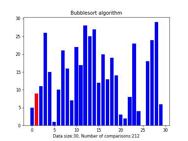
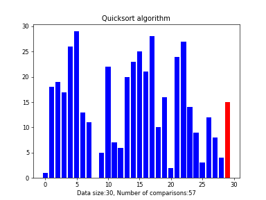
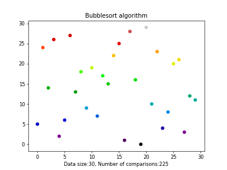
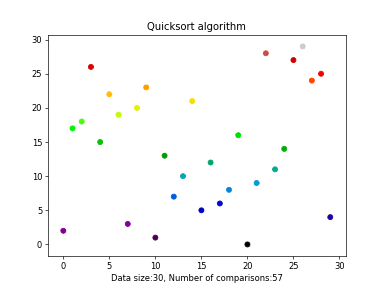

# Matplotlib sorting visualizer
Scripts to visualize sorting algorithms using matplotlib animations
### Bar graph

### Scatter graph

## Algorithms available
- Bubble sort
- Quick sort
- Heap sort

## About
The aim of this project is to make sorting algorithms easier to visualize and understand, using the animation capabilities of matplotlib.  

### Dependencies
- Python 3.6+
- Matplotlib
- Celluloid module(https://github.com/jwkvam/celluloid)
- Image magick to save as gif or ffmpeg to save as mp4

### Manual
- Install requirements

`pip install -r requirements.txt`

- Run main.py

`python main.py`

- Select Data size(default 30)
- Select the algorithm(defaut is quicksort)
- Select the type of graph(defaut bar graph)
- Choose if you want to save

